# 🚨 SIGLAT Core API

<div align="center">

**Sistema Integrated Geographic Location Alert and Tracking - Core API**

*A unified, role-based API designed to support multiple specialized frontend applications for comprehensive emergency response management.*

[](https://dotnet.microsoft.com/)
[](https://postgresql.org/)
[](https://docker.com/)
[](LICENSE)

</div>

---

## 🏗️ System Architecture

This project implements a **single API, multi-frontend architecture** providing:

✅ **Unified API** serving all frontend applications  
✅ **Role-based access control** with granular permissions  
✅ **Specialized frontends** optimized for each user type  
✅ **Consistent data layer** ensuring integrity across clients  

```mermaid
graph TB
    subgraph "Frontend Applications"
        A[👥 Citizen App<br/>Port 3000]
        B[🚑 Ambulance App<br/>Port 3001]
        C[👨‍💼 Admin App<br/>Port 3002]
    end
    
    subgraph "Core Infrastructure"
        D[🔌 SIGLAT Core API<br/>Port 5000]
        E[🗄️ PostgreSQL Database<br/>Port 5432]
    end
    
    A --> D
    B --> D
    C --> D
    D --> E
```



## 🔐 API Endpoints by Role

<table>
<tr>
<th>🌐 Public Endpoints</th>
<th>👥 Citizen Endpoints</th>
<th>🚑 Ambulance Endpoints</th>
<th>👨‍💼 Admin Endpoints</th>
</tr>
<tr>
<td>

**`/api/v1/public/`**
- 🔓 No authentication required
- User registration & login
- System health checks
- Emergency contacts
- Public information

</td>
<td>

**`/api/v1/citizen/`**
- 🔒 Role: `User`
- Emergency reporting
- Profile management
- Location sharing
- Report tracking
- Community features

</td>
<td>

**`/api/v1/ambulance/`**
- 🔒 Role: `Ambulance`
- Alert dashboard
- Response management
- Patient tracking
- Navigation assistance
- Status updates

</td>
<td>

**`/api/v1/admin/`**
- 🔒 Role: `Admin`
- User management
- System analytics
- Emergency coordination
- Multi-agency comms
- System configuration

</td>
</tr>
</table>

## 🛠️ Technology Stack

<div align="center">

| Category | Technology | Version | Purpose |
|----------|------------|---------|---------|
| **Framework** | ASP.NET Core | 8.0 | Web API framework |
| **Database** | PostgreSQL | 15+ | Primary data store |
| **ORM** | Entity Framework Core | 8.0.11 | Data access layer |
| **Query Builder** | Dapper | 2.1.66 | High-performance queries |
| **Authentication** | JWT Bearer | 8.6.0 | Token-based auth |
| **Documentation** | Swagger/OpenAPI | 6.6.2 | API documentation |
| **Containerization** | Docker | Latest | Deployment |
| **Security** | BCrypt.Net | 4.0.3 | Password hashing |

</div>

## 📁 Project Structure

```
SiglatCoreAPI/
├── Controllers/
│   ├── Public/             # No auth required
│   │   └── AuthController.cs
│   ├── Citizen/            # User role endpoints
│   │   ├── UserController.cs
│   │   ├── ChatController.cs
│   │   └── ReportController.cs
│   ├── Ambulance/          # Ambulance role endpoints
│   │   └── AmbulanceController.cs
│   └── Admin/              # Admin role endpoints
│       ├── AdminController.cs
│       ├── BFPController.cs
│       ├── PNPController.cs
│       ├── SiglatController.cs
│       ├── FloodController.cs
│       └── TyphoonController.cs
├── Models/                 # Shared DTOs
├── Services/               # Business logic
├── Data/                   # Database context
├── Middleware/             # Custom middleware
├── Migrations/             # EF Core migrations
└── Program.cs             # Application entry point
```

## 🚀 Quick Start

### 📋 Prerequisites

| Requirement | Version | Download |
|-------------|---------|----------|
| .NET SDK | 8.0+ | [Download](https://dotnet.microsoft.com/download) |
| PostgreSQL | 13+ | [Download](https://www.postgresql.org/download/) |
| Docker | Latest | [Download](https://docs.docker.com/get-docker/) (Optional) |

### ⚡ Development Setup

```bash
# 1. Clone and navigate
git clone git@github.com:Siglat/SiglatCoreAPI.git
cd SiglatCoreAPI

# 2. Install dependencies
dotnet restore

# 3. Configure environment
cp .env.example .env
# ⚠️ Edit .env with your configuration (see below)

# 4. Setup database
dotnet ef database update

# 5. Start development server
dotnet run
```

🎉 **Success!** API available at: https://localhost:7045  
📚 **Documentation**: https://localhost:7045/swagger

### 🔧 Environment Configuration

Create and configure your `.env` file:

```bash
# 📊 Database Configuration
DB_HOST=localhost                    # Database host
DB_PORT=5432                        # Database port
DB_USER=siglat_user                 # Database username
DB_PASS=your_secure_password        # Database password
DB_DB=siglat                        # Database name

# 🔐 JWT Configuration
JWT_SECRET=your-super-secret-jwt-key-at-least-32-characters-long
JWT_ISSUER=siglat-core-api
JWT_AUDIENCE=siglat-clients

# 🌐 CORS Configuration
ALLOWED_ORIGINS=http://localhost:3000,http://localhost:3001,http://localhost:3002,http://localhost:5173

# 🏷️ Environment
ASPNETCORE_ENVIRONMENT=Development
```

> ⚠️ **Security Note**: Always use strong, unique values in production!

## 📊 Database Schema

### Core Entities

- **Identity**: User management with roles (Admin, User, Ambulance)
- **Verifications**: Identity verification workflow
- **Reports**: Emergency incident reporting
- **Alerts**: Real-time emergency alerts
- **Chat**: Inter-user communication
- **Coordinates**: Location tracking
- **Contact**: Emergency contact directory
- **LoginLogs**: Authentication audit trail

### Entity Relationships

```
Identity (Users) ←→ Reports (One-to-Many)
Identity (Users) ←→ Alerts (One-to-Many)
Identity (Users) ←→ Chat (One-to-Many)
Identity (Users) ←→ Coordinates (One-to-Many)
Identity (Users) ←→ Verifications (One-to-One)
```

## 🔒 Security Features

### Authentication & Authorization
- **JWT Bearer Tokens**: Secure stateless authentication
- **Role-based Claims**: Granular access control per endpoint
- **Token Expiration**: Configurable token lifetime
- **Password Security**: BCrypt hashing with salt

### API Security
- **CORS Configuration**: Controlled cross-origin access
- **Input Validation**: Data annotation validation
- **SQL Injection Protection**: Parameterized queries via EF Core
- **Error Handling**: Secure error responses without sensitive data

## 📱 Frontend Integration

This API is designed to support multiple specialized frontend applications:

### **Citizen App** (Port 3000)
- **Target**: General public
- **Features**: Emergency reporting, status checking
- **API Access**: Public + Citizen endpoints

### **Ambulance App** (Port 3001)
- **Target**: Medical responders
- **Features**: Alert dashboard, navigation, response tracking
- **API Access**: Public + Ambulance endpoints

### **Admin App** (Port 3002)
- **Target**: System administrators
- **Features**: User management, analytics, system control
- **API Access**: Public + Admin endpoints (full access)

## 🐳 Docker Deployment

### 🚀 Quick Start with Docker Compose (Recommended)

```bash
# 1. Clone repository
git clone git@github.com:Siglat/SiglatCoreAPI.git
cd SiglatCoreAPI

# 2. Configure environment
cp .env.example .env
# Edit .env with your production values

# 3. Start all services
docker-compose up -d

# 4. Check status
docker-compose ps
```

### 📦 Single Container Deployment

```bash
# Build image
docker build -t siglat-core-api .

# Run with environment variables
docker run -d \
  --name siglat-core-api \
  -p 5000:8080 \
  -e DB_HOST=your-db-host \
  -e DB_PASS=your-db-password \
  -e JWT_SECRET=your-secret-key \
  siglat-core-api
```

### 🔧 Docker Compose Configuration

The included `docker-compose.yml` provides:

- **PostgreSQL 15** with health checks
- **API service** with dependency management
- **Persistent volumes** for data storage
- **Network isolation** for security
- **Auto-restart** policies
- **Logging** configuration

```yaml
# Key features included:
✅ Health checks for database
✅ Dependency management
✅ Volume persistence
✅ Network isolation
✅ Environment variable support
✅ Production-ready configuration
```

## 📚 API Documentation & Examples

### 🔗 Interactive Documentation

| Environment | Swagger UI | OpenAPI Spec |
|-------------|------------|--------------|
| **Development** | https://localhost:7045/swagger | https://localhost:7045/swagger/v1/swagger.json |
| **Production** | https://your-domain/swagger | https://your-domain/swagger/v1/swagger.json |

### 🔐 Authentication Flow

```bash
# 1. Register a new user
curl -X POST "https://localhost:7045/api/v1/public/auth/register" \
  -H "Content-Type: application/json" \
  -d '{
    "email": "user@example.com",
    "password": "SecurePass123!",
    "firstName": "John",
    "lastName": "Doe",
    "phoneNumber": "+1234567890"
  }'

# 2. Login to get JWT token
curl -X POST "https://localhost:7045/api/v1/public/auth/login" \
  -H "Content-Type: application/json" \
  -d '{
    "email": "user@example.com",
    "password": "SecurePass123!"
  }'

# Response:
{
  "token": "eyJhbGciOiJIUzI1NiIsInR5cCI6IkpXVCJ9...",
  "role": "User",
  "expiresAt": "2025-08-30T10:00:00Z"
}
```

### 👥 Citizen API Examples

```bash
# Get user profile
curl -X GET "https://localhost:7045/api/v1/citizen/user/profile" \
  -H "Authorization: Bearer <jwt-token>"

# Submit emergency report
curl -X POST "https://localhost:7045/api/v1/citizen/report" \
  -H "Authorization: Bearer <jwt-token>" \
  -H "Content-Type: application/json" \
  -d '{
    "type": "Medical",
    "description": "Heart attack at Manila Bay area",
    "latitude": 14.5995,
    "longitude": 120.9842,
    "severity": "High",
    "contactNumber": "+1234567890"
  }'

# Get report status
curl -X GET "https://localhost:7045/api/v1/citizen/report/status/123" \
  -H "Authorization: Bearer <jwt-token>"
```

### 🚑 Ambulance API Examples

```bash
# Get active emergency alerts
curl -X GET "https://localhost:7045/api/v1/ambulance/ambulance/all-alert" \
  -H "Authorization: Bearer <ambulance-jwt-token>"

# Update response status
curl -X PUT "https://localhost:7045/api/v1/ambulance/ambulance/response-status" \
  -H "Authorization: Bearer <ambulance-jwt-token>" \
  -H "Content-Type: application/json" \
  -d '{
    "alertId": 123,
    "status": "En Route",
    "estimatedArrival": "2025-08-29T14:30:00Z",
    "currentLocation": {
      "latitude": 14.5895,
      "longitude": 120.9742
    }
  }'
```

### 👨‍💼 Admin API Examples

```bash
# Get all users for verification
curl -X GET "https://localhost:7045/api/v1/admin/admin/userlist" \
  -H "Authorization: Bearer <admin-jwt-token>"

# Approve user verification
curl -X PUT "https://localhost:7045/api/v1/admin/admin/verify-user/123" \
  -H "Authorization: Bearer <admin-jwt-token>" \
  -H "Content-Type: application/json" \
  -d '{
    "status": "Approved",
    "remarks": "Valid government ID provided"
  }'

# Get system analytics
curl -X GET "https://localhost:7045/api/v1/admin/siglat/analytics" \
  -H "Authorization: Bearer <admin-jwt-token>"
```

### 📊 Response Examples

<details>
<summary><strong>Emergency Report Response</strong></summary>

```json
{
  "id": 123,
  "type": "Medical",
  "status": "Active",
  "severity": "High",
  "description": "Heart attack at Manila Bay area",
  "location": {
    "latitude": 14.5995,
    "longitude": 120.9842,
    "address": "Manila Bay, Metro Manila, Philippines"
  },
  "reporter": {
    "id": 456,
    "firstName": "John",
    "contactNumber": "+1234567890"
  },
  "timestamps": {
    "reported": "2025-08-29T13:45:00Z",
    "acknowledged": "2025-08-29T13:46:00Z",
    "responded": null
  },
  "assignedUnits": [
    {
      "id": 789,
      "type": "Ambulance",
      "callSign": "AMB-001",
      "status": "Dispatched"
    }
  ]
}
```
</details>

<details>
<summary><strong>Error Response Format</strong></summary>

```json
{
  "error": {
    "code": "VALIDATION_ERROR",
    "message": "Invalid request data",
    "details": [
      {
        "field": "email",
        "message": "Email address is required"
      },
      {
        "field": "password",
        "message": "Password must be at least 8 characters"
      }
    ],
    "timestamp": "2025-08-29T13:45:00Z",
    "requestId": "abc123-def456-ghi789"
  }
}
```
</details>

## 🔧 Development Guide

### 🏗️ Adding New Endpoints

Follow these steps to maintain consistency:

1. **📂 Choose Controller Location**
   ```
   Controllers/
   ├── Public/     ← No authentication
   ├── Citizen/    ← User role required
   ├── Ambulance/  ← Ambulance role required
   └── Admin/      ← Admin role required
   ```

2. **🔒 Set Authorization**
   ```csharp
   [ApiController]
   [ApiVersion("1.0")]
   [Authorize(Roles = "User")]  // ← Role requirement
   [Route("api/v{version:apiVersion}/citizen/[controller]")]
   public class ExampleController : ControllerBase
   {
       /// <summary>
       /// Gets user-specific data
       /// </summary>
       [HttpGet]
       public async Task<IActionResult> GetData()
       {
           // Implementation
           return Ok(result);
       }
   }
   ```

3. **📝 Add Documentation**
   ```csharp
   /// <summary>
   /// Creates a new emergency report
   /// </summary>
   /// <param name="report">Emergency report details</param>
   /// <returns>Created report with ID</returns>
   /// <response code="201">Report created successfully</response>
   /// <response code="400">Invalid report data</response>
   /// <response code="401">Unauthorized access</response>
   [HttpPost]
   [ProducesResponseType(StatusCodes.Status201Created)]
   [ProducesResponseType(StatusCodes.Status400BadRequest)]
   [ProducesResponseType(StatusCodes.Status401Unauthorized)]
   public async Task<IActionResult> CreateReport([FromBody] ReportDto report)
   ```

### 🛡️ Security Best Practices

```csharp
// ✅ Input validation
[Required]
[EmailAddress]
public string Email { get; set; }

[Required]
[StringLength(100, MinimumLength = 8)]
public string Password { get; set; }

// ✅ SQL injection prevention
var user = await _context.Users
    .Where(u => u.Email == email)  // ← Parameterized
    .FirstOrDefaultAsync();

// ✅ Sensitive data handling
public class UserResponseDto 
{
    public int Id { get; set; }
    public string Email { get; set; }
    // ❌ Never expose: Password, SecurityTokens
}

// ✅ Role-based authorization
[Authorize(Roles = "Admin")]
public async Task<IActionResult> GetSensitiveData()
```

### 🗃️ Database Migrations

```bash
# Create new migration
dotnet ef migrations add AddNewFeature

# Review generated migration
code Migrations/20250829_AddNewFeature.cs

# Apply migration
dotnet ef database update

# Rollback if needed
dotnet ef database update PreviousMigration
```

### 🧪 Testing Strategy

```csharp
// Unit test example
[Test]
public async Task CreateReport_ValidData_ReturnsCreated()
{
    // Arrange
    var reportDto = new ReportDto 
    { 
        Type = "Medical",
        Description = "Test emergency"
    };

    // Act
    var result = await _controller.CreateReport(reportDto);

    // Assert
    Assert.IsInstanceOf<CreatedResult>(result);
}

// Integration test example
[Test]
public async Task POST_CreateReport_RequiresAuthentication()
{
    // Act
    var response = await _client.PostAsync("/api/v1/citizen/report", content);

    // Assert
    Assert.AreEqual(HttpStatusCode.Unauthorized, response.StatusCode);
}
```

## 🚀 Migration from Previous Version

<div align="center">

### ⬆️ Upgrading from SIGLAT-API v1.x

</div>

| **Previous Version** | **SIGLAT Core API** | **Status** |
|---------------------|-------------------|------------|
| Monolithic structure | Role-based organization | ✅ **Improved** |
| Basic authentication | JWT with role claims | ✅ **Enhanced** |
| Single frontend support | Multi-frontend architecture | ✅ **New Feature** |
| Limited documentation | Comprehensive Swagger docs | ✅ **Enhanced** |

### 🔄 Migration Checklist

- [ ] **Routes**: Update frontend calls to include role prefix (`/citizen/`, `/admin/`)
- [ ] **Authentication**: Implement JWT token handling in frontends
- [ ] **Permissions**: Review and update user role assignments
- [ ] **Environment**: Update configuration to new `.env` format
- [ ] **Database**: Run migration scripts to update schema

### 📋 Breaking Changes

```diff
- POST /api/report                    ❌ Old endpoint
+ POST /api/v1/citizen/report         ✅ New endpoint

- GET /api/users                      ❌ Old endpoint  
+ GET /api/v1/admin/admin/userlist    ✅ New endpoint

- Basic Auth: username/password       ❌ Old method
+ JWT Bearer: Authorization header    ✅ New method
```

## 🤝 Contributing

<div align="center">

**We welcome contributions! Here's how to get started:**

</div>

### 🌟 Contribution Workflow

```bash
# 1. Fork & Clone
git clone https://github.com/YOUR_USERNAME/SiglatCoreAPI.git
cd SiglatCoreAPI

# 2. Create Feature Branch
git checkout -b feature/amazing-feature

# 3. Make Changes
# Follow our coding standards and role-based organization

# 4. Test Changes
dotnet test
dotnet run  # Verify API works

# 5. Commit & Push
git commit -m "Add amazing feature for emergency response"
git push origin feature/amazing-feature

# 6. Create Pull Request
# Include description of changes and testing done
```

### 📏 Code Standards

- ✅ Follow **role-based organization** principles
- ✅ Add proper **authorization attributes** (`[Authorize(Roles = "...")]`)
- ✅ Include **XML documentation** for all public methods
- ✅ Write **unit tests** for new functionality
- ✅ Update **README** if adding new features
- ✅ Use **async/await** for all I/O operations

### 🎯 What We're Looking For

| Priority | Type | Examples |
|----------|------|----------|
| **High** | Security improvements | Authentication enhancements, input validation |
| **High** | Performance optimizations | Query improvements, caching strategies |
| **Medium** | New API endpoints | Additional emergency response features |
| **Medium** | Testing improvements | Integration tests, load tests |
| **Low** | Documentation | Code comments, API examples |

## 📄 License & Support

<div align="center">

### 📜 License

This project is licensed under the **ISC License** - see the [LICENSE](LICENSE) file for details.

### 🆘 Getting Help

| Type | Channel | Response Time |
|------|---------|---------------|
| 🐛 **Bug Reports** | [GitHub Issues](https://github.com/Siglat/SiglatCoreAPI/issues) | 24-48 hours |
| 💡 **Feature Requests** | [GitHub Discussions](https://github.com/Siglat/SiglatCoreAPI/discussions) | 1-3 days |
| 📧 **General Support** | support@siglat.org | 1-2 business days |
| 📚 **Documentation** | [API Docs](https://your-domain/swagger) | Always available |

### 🌐 Community

[](https://github.com/Siglat/SiglatCoreAPI)
[](https://github.com/Siglat/SiglatCoreAPI)
[](https://github.com/Siglat/SiglatCoreAPI/issues)
[](https://github.com/Siglat/SiglatCoreAPI/pulls)

</div>

---

<div align="center">

**🚨 SIGLAT Core API** - *Powering the next generation of emergency response systems*

**Built with ❤️ for public safety and emergency response teams**

</div>